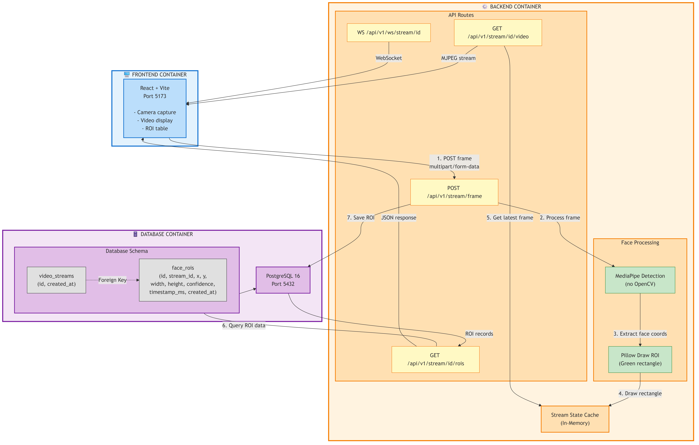

# Mega AI - Real-Time Face Detection Video Streaming System

Production-style full stack implementation for an interview assignment.

## Overview
This project accepts a live video feed, detects a single face per frame (no OpenCV), draws an ROI rectangle, stores ROI metadata, and serves both the processed stream and ROI data to a frontend.

## Tech Stack
- Backend: FastAPI, SQLAlchemy (async), MediaPipe, Pillow
- Frontend: React + Vite
- Database: PostgreSQL
- Streaming: HTTP MJPEG + optional WebSocket
- Infra: Docker + Docker Compose

## API Endpoints
- `POST /api/v1/stream/frame` : Ingest a frame (`multipart/form-data`) with `stream_id`, `timestamp_ms`, `frame`
- `GET /api/v1/stream/{stream_id}/video` : MJPEG stream with ROI rectangle drawn
- `GET /api/v1/stream/{stream_id}/rois` : Latest 200 ROI records
- `GET /health` : Service health
- `WS /api/v1/ws/stream/{stream_id}` : Optional JSON stream of base64 frames

## Run in 5 Minutes (Docker)
1. Install Docker Desktop.
2. From repo root:
   ```bash
   docker compose up --build
   ```
3. Open the frontend at `http://localhost:5173`.
4. Click `Start Camera Stream`.

## Local Dev (No Docker)
This is optional but useful when Docker is unavailable.

Backend:
```bash
cd backend
python -m venv .venv
source .venv/bin/activate  # Windows: .\.venv\Scripts\Activate.ps1
pip install -r requirements.txt
export DATABASE_URL=sqlite+aiosqlite:///./mega_ai.db  # Windows: $env:DATABASE_URL = "sqlite+aiosqlite:///./mega_ai.db"
export CORS_ORIGINS=http://localhost:5173            # Windows: $env:CORS_ORIGINS = "http://localhost:5173"
uvicorn app.main:app --reload --host 0.0.0.0 --port 8000
```

Frontend:
```bash
cd frontend
export VITE_API_BASE=http://localhost:8000  # Windows: $env:VITE_API_BASE = "http://localhost:8000"
npm install
npm run dev
```

## Configuration
See [backend/.env.example](backend/.env.example) for environment variables used by the backend.

## Data Model
- `video_streams`: stream identity and creation timestamp
- `face_rois`: ROI (`x`, `y`, `width`, `height`, `confidence`, `timestamp_ms`)

## Testing
```bash
cd backend
pip install -r requirements.txt
pytest -q
```

## Architecture Diagram
The system consists of three containerized components communicating via Docker network:



**Data Flow:**
1. Frontend captures video frames from camera
2. POST `/api/v1/stream/frame` sends frames to backend
3. Backend processes frames using MediaPipe face detection + Pillow drawing
4. Detected ROI rectangles cached in memory & stored in PostgreSQL
5. GET `/api/v1/stream/{id}/video` streams MJPEG back to frontend
6. GET `/api/v1/stream/{id}/rois` returns JSON ROI records
7. WebSocket provides real-time frame streaming alternative

## Security Fundamentals Implemented
- Input validation for frame content type and empty payload
- CORS restriction via environment configuration
- SQL injection-safe ORM usage
- No sensitive data in source (env-based config)

## AI Tool Attestation
AI assistance was used for:
- Initial project scaffolding and architecture drafting
- API contract shaping and edge-case checklist
- README and documentation polishing

All generated code was manually reviewed and adjusted for correctness, assignment constraints, and production readiness.
